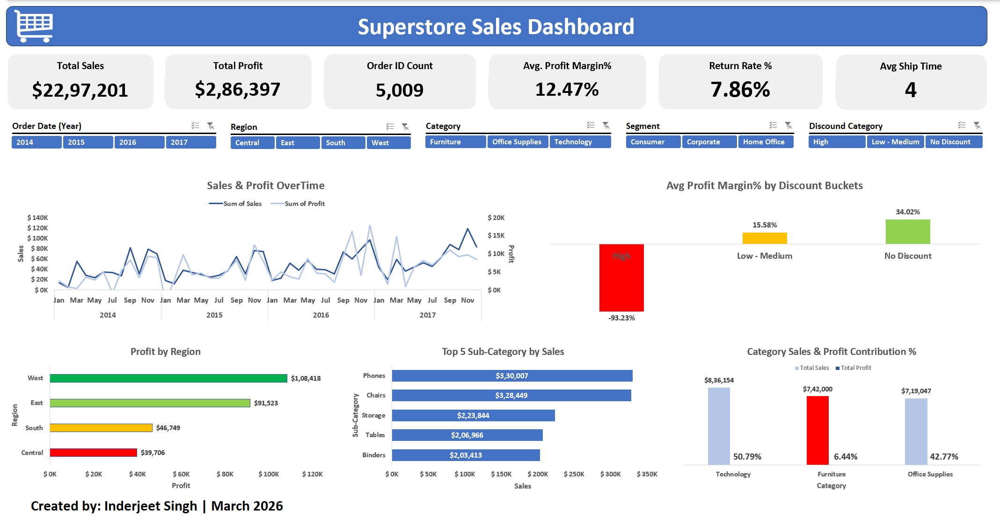
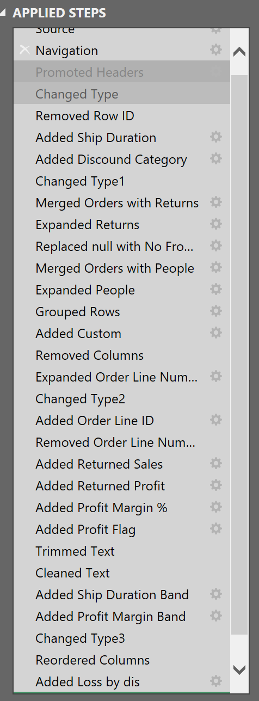

# 📊 Superstore Sales Dashboard - Excel Project

Interactive Excel dashboard analyzing 9,994 US retail orders to uncover sales trends, discount impact on profitability, and regional performance insights.

---

## 📊 Dashboard Preview



---

## 🎯 Project Overview
Comprehensive sales analysis dashboard built in Excel using Power Query ETL and pivot table analytics to identify business opportunities and profitability drivers across a 4-year retail dataset.

**Key Focus Areas:**
- Sales trends and seasonality patterns
- Regional performance analysis
- Discount impact on profit margins
- Product category profitability
- Return rate tracking

---
## 📁 Dataset
- **Source:** Sample Superstore Dataset (US Retail Sales)
- **Period:** January 2014 - December 2017 (4 years)
- **Records:** 9,994 orders across 3 segments, 4 regions, and 17 sub-categories
- **Tables:** Orders, Returns, People (Regional Managers)

## 🛠️ Tools & Technologies
- **Microsoft Excel** - Dashboard development and visualization
- **Power Query** - Data cleaning and transformation
- **Pivot Tables & Pivot Charts** - Data analysis and visualization
- **Slicers** - Interactive filtering

## 🔄 Data Cleaning & Transformation (Power Query)

Performed comprehensive ETL process with **25+ transformation steps:**



### Key Transformations:
1. **Data Type Corrections**
   - Converted dates, numbers, and text to appropriate types
   - Handled postal codes as text to preserve leading zeros

2. **Calculated Columns Created:**
   - **Ship Duration:** `Ship Date - Order Date` (days to deliver)
   - **Profit Margin %:** `Profit / Sales` (used in dashboard KPI)
   - **Returned Sales:** Sales amount for returned orders
   - **Returned Profit:** Profit impact of returns
   - **Order Line ID:** Unique identifier combining Order ID and line number
   - **Additional categorization fields:** Discount bands, shipping speed categories, profit flags
     
3. **Data Integration:**
   - **Merged** Orders with Returns table (left join) to identify returned items
   - **Merged** Orders with People table to assign regional managers
   - Replaced null values in Returns with "No" for clarity

4. **Returns Handling:**
   - **Returned Sales:** Calculated sales amount for returned orders
   - **Returned Profit:** Calculated profit impact of returns
   - Filtered and flagged return status for analysis

5. **Data Quality:**
   - Trimmed and cleaned text columns (removed extra spaces)
   - Created unique **Order Line ID** for granular tracking
   - Grouped and indexed order line numbers

6. **Column Reordering:** Organized columns logically for analysis

---

## 📊 Dashboard Features

### Key Performance Indicators (6 KPIs)
- **Total Sales:** ~$2.3M (4-year cumulative)
- **Total Profit:** $286K (12.47% average margin)
- **Order Volume:** 5,009 orders processed
- **Return Rate:** 7.86% of sales value returned
- **Avg Ship Time:** 4 days from order to delivery
  
### Interactive Visualizations

#### 1. **Sales & Profit Overtime** (Line Chart - Monthly Trend)
- 48 months of data showing seasonality patterns
- Dual-axis: Sales (left) and Profit (right)
- **Key Finding:** Clear Q4 spike in sales (Nov-Dec holiday shopping)
- Identifies peak months and growth trends from 2014-2017

#### 2. **Avg Profit Margin% by Discount Buckets** (Column Chart)
- **CRITICAL INSIGHT:** Shows discount impact on profitability
- **High Discounts (≥40%):** -93.23% margin (massive losses!)
- **Low-Medium Discounts:** 15.58% margin (profitable)
- **No Discount:** 34.02% margin (most profitable)
- **Color-coded:** Red (loss), Yellow (moderate), Green (best)

#### 3. **Profit by Region** (Horizontal Bar Chart)
- Color-coded performance: Green (West - best) to Red (Central - worst)
- **West:** $108,418 profit (37.8% of total)
- **East:** $91,523 profit (32.0%)
- **South:** $46,749 profit (16.3%)
- **Central:** $39,706 profit (13.9% - underperforming)

#### 4. **Top 5 Sub-Categories by Sales** (Horizontal Bar Chart)
- Phones: $330,007 (highest sales)
- Chairs: $328,449
- Storage: $223,844
- Tables: $206,966
- Binders: $203,413

#### 5. **Category Sales & Profit Contribution %** (Combo Chart)
- Shows each category's share of total profit
- **Technology:** 50.79% of profit (dominates!)
- **Furniture:** 6.44% of profit (RED - problem category!)
- **Office Supplies:** 42.77% of profit
- **Key Insight:** Furniture has high sales but terrible profit contribution


### Interactive Filtering (5 Slicers)
- **Order Date (Year):** 2014, 2015, 2016, 2017
- **Region:** Central, East, South, West
- **Category:** Furniture, Office Supplies, Technology
- **Segment:** Consumer, Corporate, Home Office
- **Discount Category:** High, Low-Medium, No Discount

**All slicers are connected** - filtering one updates all charts dynamically!

---

## 💡 Key Business Insights

### 1. 🔴 Heavy Discounts Reduce Profit
Products with **≥40% discounts show a -93% profit margin**, meaning the company loses about **$0.93 for every $1 sold**. In comparison, **low–medium discounts give 15.58% margin**, while **no-discount items reach about 34% margin**.

### 2. 📍 Regional Performance Gap
The **West region generates about 38% of total profit ($108K)**, while the **Central region contributes only 14% ($40K)**, showing a **2.7× gap** between the best and weakest regions.

### 3. 🛒 Furniture Category Profit Issue
Although **Furniture contributes around 32% of sales ($742K)**, it generates only **6.44% of total profit ($18K)** with a **2.4% margin**, much lower than **Technology (~17% margin)**.

### 4. 📅 Seasonal Sales Trend
Sales are highest in **Q4 (November–December)** due to holiday demand, with **November consistently being the strongest month**. Overall sales also show **steady growth from 2014 to 2017**.

### 5. 📦 Impact of Product Returns
The overall **return rate is about 7.86% of sales**, which reduces the company’s effective profit and highlights the need to understand return reasons.

---

## 💡 Recommendations

### 1. Limit High Discounts
Avoid discounts above **40%** and consider capping them at **30%** to prevent major profit losses.

### 2. Improve Central Region Performance
Analyze pricing, product mix, and discount practices in the **Central region** and adopt strategies used by the **West region**.

### 3. Review Furniture Pricing and Costs
Investigate **Furniture cost structure and pricing**, and reduce focus on low-margin products while prioritizing **Technology and Office Supplies**.

### 4. Prepare for Seasonal Demand
Increase **inventory and marketing efforts from September to November** to capture peak Q4 demand.

### 5. Reduce Product Returns
Analyze **return reasons by category**, improve product information, and consider **restocking policies** for high-return products.

## 📂 Repository Structure

```
├── screenshots
│   ├── dashboard_screenshot.png
│   └── power_query_steps.png
│
├── SuperStore_Sales_Dashboard.xlsx
└── README.md                             # Project documentation
```

## 🚀 How to Use

1. **Download** the Excel file from this repository
2. **Enable Content** if prompted (for slicers to work)
3. **Interact with Slicers:**
   - Filter by Year, Region, Discount Category, Category, or Sub-Category
   - All charts update dynamically
4. **Explore Sheets:**
   - **Dashboard:** Main interactive view
   - **Orders:** Cleaned and transformed data
   - **PT_*** sheets:** Underlying pivot tables

## 🎓 Skills Demonstrated

- **ETL Process:** Power Query data transformation (25+ steps)
- **Data Modeling:** Table relationships and calculated columns
- **Data Analysis:** Pivot tables with complex aggregations
- **Data Visualization:** Chart selection and design principles
- **Business Intelligence:** KPI development and insight generation
- **Dashboard Design:** Layout, color coding, and interactivity
- **Excel Functions:** Advanced formulas and calculations

## 📈 Technical Highlights

- **Power Query M Code:** 40+ transformation steps
- **Calculated Fields:** Profit margins, discount categories, shipping bands
- **Conditional Logic:** IF statements for categorization
- **Date Intelligence:** Date grouping and time-series analysis
- **Dynamic Filtering:** Connected slicers across multiple pivot tables

## 🔗 Connect With Me

**Inderjeet Singh**  
Aspiring Data Analyst | SQL | Excel | Power BI

📧 Email: inderjeetsingh152005@gmail.com  
💼 LinkedIn: https://www.linkedin.com/in/inderjeet-singh-data/ 
💻 GitHub: https://github.com/inderjeet-singh-data

--- 

**⭐ If you found this project helpful, please consider giving it a star!**

*Project completed: March 2026*


